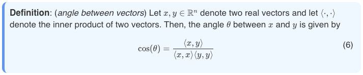

# Syntax

This page is about the modified markdown syntax that is used in JuDoc.
For the HTML templating syntax, see [Templating](@ref).

A good way to become familiar with the JuDoc syntax is to generate a test-website and modify its `index.md` as explained in the [Quick start](@ref) tutorial.
Most of what is presented here is also shown in that example.

**Contents**:

* [Basic syntax](#Basics-1)
  * [Maths](#Maths-1)
  * [Div blocks](#Div-blocks-1)
  * [Table of contents](#Table-of-contents-1)
  * [Using raw HTML](#Using-raw-HTML-1)
  * [Comments](#Comments-1)
* [LaTeX commands](#LaTeX-commands-1)
  * [Nesting](#Nesting-1)
  * [Whitespaces](#Whitespaces-1)
  * [Local vs global](#Local-vs-global-1)
  * [Hyper-references](#Hyper-references-1)
* [Code insertions](#Code-insertions-1)
  * [On-the-fly evaluation](#On-the-fly-evaluation-1)
    * [More on paths](#More-on-paths-1)
    * [Inserting the output](#Inserting-the-output-1)
    * [Hiding lines](#Hiding-lines-1)
  * [Separate evaluation](#Separate-evaluation-1)
    * [Inserting code](#Inserting-code-1)
    * [Plain-text output](#Plain-text-output-1)
    * [Plot output](#Plot-output-1)
    * [Slicing up](#Slicing-up-1)
* [File insertions](#File-insertions-1)
* [Page variables](#Page-variables-1)
  * [Local page variables](#Local-page-variables-1)
    * [Default variables](#Default-variables-1)
  * [Global page variables](#Global-page-variables-1)

## Basics

The basic syntax corresponds to standard markdown and the [markdown cheatsheet](https://github.com/adam-p/markdown-here/wiki/Markdown-Cheatsheet) is a great resource, in particular:

* how to [insert images](https://github.com/adam-p/markdown-here/wiki/Markdown-Cheatsheet#images),
* how to [insert code](https://github.com/adam-p/markdown-here/wiki/Markdown-Cheatsheet#code-and-syntax-highlighting),
* how to [insert tables](https://github.com/adam-p/markdown-here/wiki/Markdown-Cheatsheet#tables).

One key difference with Git Flavored Markdown (GFM) is that inline HTML _should not be used_ (see the section on injecting HTML below).

### Maths

For maths elements the usage is similar to standard LaTeX; whitespaces and new-lines don't matter.
To see what you can and can't do in KaTeX, refer to [their docs](https://katex.org/docs/support_table.html) or [this page](https://utensil-site.github.io/available-in-katex/).

In JuDoc you can have

* inline math with `$ ... $` (if you want to write a dollar symbol, you can escape it like so: `\$`) e.g.:

```judoc
the function $ f(x)=\sin(x) $ is periodic, this is a dollar sign: \$.
```

* display math with `$$ ... $$` or `\[ ... \]` e.g.:

```judoc
the identity
\[ \exp(i\pi)+1=0 \]
is nice
```

* display + aligned math (1) with `\begin{align} ... \end{align}` e.g.:

```judoc
\begin{align}
a&=5 \\
b&=7 \end{align}
```

* display + aligned math (2) with `\begin{eqnarray} ... \end{eqnarray}` e.g.:

```judoc
\begin{eqnarray}
a &=& 5 \\
b &=& 7 \end{eqnarray}
```

!!! note

    In LaTeX use of `eqnarray` tends to be discouraged due to possible interference with array column spacing. In JuDoc this will not happen. However it is identical with LaTeX in that the spacing around the `=` in a `eqnarray` is larger than in an `align` which you may prefer.

!!! note

    Currently all display-math equations are numbered by default.

A final element to keep in mind is that you should surround inequality operators with whitespaces in order to avoid ambiguous commands in KaTeX.
So in particular, both: `$0< C$` or `$0 < C$` are fine but `$0 <C$` isn't.
When in doubts add whitespaces.

### Div blocks

In order to locally style your content, you can use `@@divname ... @@` which will wrap some content in a `<div class="divname"> ... </div>` block which you can style as you wish in your CSS stylesheet.
For instance, you may want to highlight some content with a light-yellow background, you can do this with:

```judoc
Some text then
@@important
Some important content
@@
and the rest of your text
```

and then, in your CSS, you could use

```css
.important {
  background-color: lemonchiffon;
  padding-left: 0.5em;
  padding-top: 0.7em;
  padding-bottom: 0.5em;
  border-radius: 5px;
}
```

which will look like

!!! important

    Some important content

These div blocks can be nested as in standard HTML.

### Table of contents

JuDoc can insert automatically generated table of contents simply by using `\toc` or `\tableofcontents` somewhere appropriate in your markdown.
The table of contents will be generated in a `jd-toc` div block, so if you would like to modify the styling, you should modify `.jd-toc ol`, `.jd-toc li` etc in your CSS.

### Using raw HTML

You can inject HTML by using `~~~ ... ~~~` which can be useful if, for instance, you occasionally want to use a specific layout such as text next to an image:

```judoc
Some text here in the "standard" layout then you can inject raw HTML:

~~~
<div class="row">
  <div class="container">
    
    <p> Marine iguanas are truly splendid creatures. </p>
    <p> Evolution is cool. </p>
    <div style="clear: both"></div>      
  </div>
</div>
~~~

and subsequently continue with the standard layout.
```

!!! note

    In a raw HTML, you cannot use markdown, maths etc. For this reason, it is often preferable to use nested `@@divname...` blocks instead of raw HTML since those _can_ have markdown, maths, etc. in them. (See also the example generated by [`newsite`](@ref).)

### Comments

You can add comments in your markdown using HTML-like comments: `<!-- your comment -->` possibly on multiple lines.
Note that comments are _not allowed_ in a math environment.
So this:

```judoc
Some markdown here $\sin(\alpha+\beta)=\sin\alpha\cos\beta+\cos\alpha\sin\beta$ then
<!--
TODO: add other formulas
-->
and then some more markdown
```

is fine but:

```judoc
$$
\exp(i\pi)+1 = 0 <!-- this is very pretty -->
$$
```

is not.


## LaTeX commands

JuDoc allows the definition of LaTeX-like commands which can be particularly useful for repeating elements be it in or out of math environments.

Definition of commands is as in LaTeX (with the constraint that you _must_ use the `\newcommand{...}[...]{...}` format; see examples below).

**Example 1**: a command to get a ``\mathbb R`` in math environments:

```judoc
\newcommand{\R}{\mathbb R}

Let $f:\R\to\R$ a function...
```

**Example 2**: a command to get a ``\langle x, y \rangle`` in math environments:

```judoc
\newcommand{\scal}[1]{\left\langle #1 \right\rangle}
```

**Example 3**: a command to change the colour of the text outside of a math environment (note that inside a math environment you can use `\textcolor` which is defined in KaTeX; I'm using a different name here so that these two don't clash since commands defined in JuDoc take precedence):

```judoc
\newcommand{\col}[2]{~~~ <span style="color:#1">#2</span> ~~~}

And then you can use \col{tomato}{colours} in your text and
$$x + \textcolor{blue}{y} + z$$
in your maths.
```

!!! note

    Command names should currently only contain letters. This could be relaxed, for instance to allow underscore and numbers (since JuDoc strictly enforces the use of braces around command arguments, it wouldn't be ambiguous). If you think that would be useful, please open an issue.

### Nesting

Using commands can be nested --as in LaTeX-- and, moreover, you can throw in some judoc markdown.
Here is a somewhat more sophisticated example for a "definition" environment:

```judoc
\newcommand{\definition}[2]{@@definition **Definition**: (_!#1_) #2 @@}

\definition{angle between vectors}{
  Let $x, y \in \R^n$ denote two real vectors and let $\scal{\cdot, \cdot}$ denote
  the inner product of two vectors. Then, the angle $\theta$ between $x$ and $y$ is
  given by $$ \cos(\theta) = {\scal{x,y}\over \scal{x,x} \scal{y,y}} $$ }
```

with CSS

```css
.definition {
    background-color: aliceblue;
    border-left: 5px solid cornflowerblue;
    border-radius: 10px;
    padding: 10px;
}
```

it will look like



Of course, you can also nest definitions:

```judoc
\newcommand{\norm}[2]{\left\|#1\right\|_{#2}}
\newcommand{\anorm}[1]{\norm{#1}{1}}
\newcommand{\bnorm}[1]{\norm{#1}{2}}

Let $x\in\R^n$, there exists $0 < C_1 \le C_2$ such that

$$ C_1 \anorm{x} \le \bnorm{x} \le C_2\anorm{x}. $$
```

where the final equation would look like ``C_1 \|x\|_1 \le \|x\|_2 \le C_2\|x\|_1``.

### Whitespaces

In a JuDoc newcommand, to refer to an argument, you can use `#1` or `!#1`.
There is a subtle difference: the first one introduces a space left of the argument (this allows to avoid ambiguous commands in general) and the second one does not.
In general whitespaces are irrelevant and will not show up and so the usual `#1` is the recommended setting.
However, there are cases where the whitespace does appear and you don't want it to (e.g. outside a math environment if the command is directly preceded by something).
In those cases, and provided there is no ambiguity (e.g.: due to chaining commands), you can use `!#1` which will *not* insert the whitespace.
For instance:

```judoc
\newcommand{\pathwith}[1]{`/usr/local/bin/#1`}
\newcommand{\pathwithout}[1]{`/usr/local/bin/!#1`}
```

* `\pathwith{hello}` will give `/usr/local/bin/ hello` which would be inappropriate whereas
* `\pathwithout{hello}` will give `usr/local/hello`.

### Local vs global

The commands you define will be available _only_ within the page you define them in.
However, if you would like to define commands that are _globally_ available to all pages, then you should simply put these definitions in `src/config.md`.

### Hyper-references

Three types of hyper-references are supported:

* for display math,
* for bibliography references,
* for specific anchor points in the page.

The syntax for all three is close to that of standard LaTeX (see below).

To style the appearance of the maths or bib links in CSS, use `.jd-content.eqref a` and `.jd-content.bibref a` classes; for instance:

```css
.jd-content .eqref a  {color: blue;}
.jd-content .bibref a {color: green;}
```

#### Equations

To label an equation, just use `\label{some label}` in the math environment and, to refer to it, use `\eqref{some label}`:

```judoc
Some equation:

$$\exp(i\pi) + 1 = 0 \label{a cool equation}$$

and you can refer to it in the text like so, equation \eqref{a cool equation}.
```

As in LaTeX, you can refer to several equations in one by separating names with commas: `\eqref{some label, some other}` (and so you should not use commas in your labels).

#### Bibliography

For bibliography references, you can use `\biblabel{short}{name}` to indicate a bibliography reference which will appear as a clickable link `(name)` or `name` and can be referred to by `short`:

```judoc
In the text you may refer to \citep{noether15, bezanson17} while in a bibliography
section you would have

* \biblabel{noether15}{Noether (1915)} **Noether**, Korper und Systeme rationaler Funktionen, 1915.
* \biblabel{bezanson17}{Bezanson et al. (2017)} **Bezanson**, **Edelman**, **Karpinski** and **Shah**, [Julia: a fresh approach to numerical computing](https://julialang.org/publications/julia-fresh-approach-BEKS.pdf), SIAM review 2017.
```

The `name` argument therefore corresponds to how the bibliography reference will appear in the text.
In the case above, the text will lead to

```
... refer to (Noether (1915), Bezanson et al. (2017)) while ...
```

You can use

* `\cite{short1, short2}` or `\citet{short3}`: will not add parentheses around the link(s),
* `\citep{short4, short5}`: will add parentheses around the link(s).

As in LaTeX, if the reference is undefined, the command will be replaced by **(??)**.

!!! note

    In the future, there may be a possibility to define specific bibliography styles.
    I've not yet come around to it but feel free to open an issue if you would like this or would like to suggest a way to do it.

#### Anchor points

You can specify anchor points on the page by using `\label{name of the anchor}` anywhere on the page outside of maths environment.
This will insert an anchor:

```html
<a id="name-of-the-anchor"></a>
```

You can subsequently add a link to it on the same page:

```judoc
[link to it](#name-of-the-anchor)
```

or from another page by prepending it with the path to the page, for instance:

```judoc
[link to it](/index.html#name-of-the-anchor)
```

Note also that all section headers are anchor points for instance

```judoc
### Some subtitle
```

can be linked to with `#some-subtitle`.

!!! note

    In the future, a number will be appended to anchor-points corresponding to section headers so that if you have two headers with the same name, the links can be differentiated (issue [#180](https://github.com/tlienart/JuDoc.jl/issues/180)). (Same as Documenter.jl.)


## Code insertions

Sometimes, when presenting code in a post, you would like to make sure the code works and it can be annoying to have to copy-paste it around then copy its output, especially if you decide to make modifications on the way in which case you have to repeat the process.

In JuDoc there are two ways to do this.

1. For Julia, a live-evaluation of code blocks is supported not unlike the [Weave.jl](https://github.com/mpastell/Weave.jl) package,
1. For all languages, you can run the script separately and insert the code and/or the output of the code in the page.

### On-the-fly evaluation

!!! note

    **Evaluation time**: it is important to realise that when the code block is created or modified and the page is saved, it will trigger a page compilation that will _wait_ for the evaluation of the code block to complete. So if your code block takes a long time to execute, the page will not be updated before that's done.
    That being said, if you don't modify the code block, it will only be executed **once** as the output is saved to file.

!!! note

    **Sandboxing**: on-the-fly evaluation of code blocks is still a bit experimental. Among other things, the code is _not sandboxed_ which means that if you have two code blocks one after the other, the second one has access to what's defined in the first. This is natural within the same page, but it also works _across_ pages. However it would be really bad practice to rely on this as the order in which pages are compiled is not always the same.
    In short: take a page as one Julia notebook and pay attention to all your variables and functions to be defined on that page.

Code blocks that should not be evaluated should be added as per standard markdown, so for instance:

`````judoc
```julia
a = 10
```
`````

Code blocks that should be evaluated should be added with `julia:path/to/script` where `path/to/script` indicates _where_ the script corresponding to the code block will be saved (**note**: the given path _must_ be in UNIX format)

`````judoc
```julia:./code/ex1
a = 10
@show a
```
`````

What this will do is:

1. write the code to the file `/assets/[subpath]/code/ex1.jl`
1. run the code and capture its output (`STDOUT`) and write it to `/assets/[subpath]/code/output/ex1.out`

The `[subpath]` here is the _exact same sub-path structure_ than to the page where the code block is inserted.
To clarify, let's say you wrote the above code-block in

```
/src/pages/folder1/page1.md
```

then with the syntax above, the script will be saved in

```
/assets/pages/folder1/code/ex1.jl
```

#### More on paths

There are three ways you can specify where the script corresponding to a code-block should be saved.

1. relative to the page: `./[p]/script` is as above, it will write the code block to `/assets/[subpath]/p/script.jl` where `subpath` corresponds to the sub-path of the page where the code block is inserted (path below `/src/`)
1. relative to the assets dir: `p/script` will write the code block to `/assets/p/script.jl`
1. full path: `/p/script` will write the code block to `/p/script.jl`

**Note**: when code blocks are evaluated, their output (`STDOUT`) is captured and saved at `[path]/output/script.out` where `[path]` is what precedes `script.jl` in the cases above.

#### Inserting the output

Let's say you've added the following code block:

`````judoc
```julia:./code_pg1/ex1
using LinearAlgebra
a = [1, 2, 3]
@show dot(a, a)
```
`````

In order to show the raw output, just write

```judoc
\output{./code_pg1/ex1}
```

which in the present example will introduce exactly the following HTML

```html
<pre><code>dot(a, a) = 14</code></pre>
```

and will look like

```
dot(a, a) = 14
```

If you now change the vector `a` in the code block, the page will be re-compiled with the code-block re-evaluated and the new output will be shown.

If you would like the output to appear as text (not a code block), you can use `\textoutput` instead.
Here's an example:

`````judoc
```julia:./code_pg1/ex2
using Statistics
temps = (15, 15, 14, 16, 18, 19, 20, 12, 10, 24)
println("The _average_ temperature is **$(mean(temps))°C**.")
```
\textoutput{./code_pg1/ex2}
`````

Which will appear as:

```julia
using Statistics
temps = (15, 15, 14, 16, 18, 19, 20, 12, 10, 24)
println("The _average_ temperature is **$(mean(temps))°C**.")
```

The _average_ temperature is **16.3°C**.

#### Hiding lines

Sometimes you may want to run some lines but hide them from the presentation, for this just use `# hide` at the end of the line (`hide` is not case sensitive so `# HiDe` would be fine too):

`````judoc
```julia:./code_pg1/ex1
using LinearAlgebra # hide
a = [1, 2, 3]
@show dot(a, a)
```
`````

You could also hide the entire code block if you only care about the output, for this put a `# hideall` on any line:

`````judoc
```julia:./code_pg1/ex2
#hideall
using Statistics
temps = (15, 15, 14, 16, 18, 19, 20, 12, 10, 24)
println("The _average_ temperature is **$(mean(temps))°C**.")
```
\textoutput{./code_pg1/ex2}
`````

Which will appear as just:

The _average_ temperature is **16.3°C**.

### Separate evaluation

The philosophy here is:

* keep your code snippets in appropriate subfolders of `/assets/` where they can be run and their output can be saved, this can be compared to a `test/` folder in a Julia package,
* run some or all of the snippets (before running JuDoc),
* use `\input{...}{...}` in your markdown (see below) and when the website is updated, it will plug-in the most recent parts that have been generated.

That way, if you modify the code, everything will be updated on the website too while ensuring that the code actually runs and generates the output you're displaying.

Again, the script files can contain `# hide` at the end of lines you do not want to show.

The `generate_results.jl` file should run the scripts and redirect outputs to the `assets/[path]/output` directory.
You can use something like the script below (if you generate an example website with [`newsite`](@ref), it's already in there) though you can of course modify it as you wish.

```julia
dir = @__DIR__
"""
    genplain(s)

Small helper function to run some code and redirect the output (stdout) to a file.
"""
function genplain(s::String)
    open(joinpath(dir, "output", "$(splitext(s)[1]).out"), "w") do outf
        redirect_stdout(outf) do
            include(joinpath(dir, s))
        end
    end
end
# run `script1.jl` and redirect what it prints to `output/script1.out`
genplain("script1.jl")
# run `script2.jl` which has a savefig(joinpath(@__DIR__, "output", "script2.png"))
include("script2.jl")
```

The function `genplain("scriptname.jl")` just redirects the output of the script to `output/scriptname.out`.
So for instance if you have in `assets/scripts/script1.jl`

```julia
print("hello")
```

Then `genplain("script1.jl")` will generate `/assets/scripts/output/script1.out` with content

```julia
hello
```

!!! note

    You could have scripts in any language here (`R`, `Python`, ...) as long as the folder structure is the same.

#### Inserting code

In order to insert the code of a script and have it highlighted you can use

```judoc
\input{julia}{scripts/script1.jl}
```

or `\input{code:julia}{scripts/script1.jl}`. This will insert the content of the file `/assets/scripts/script1.jl` (see also the section earlier on paths) into a block that will be highlighted as julia code.

#### Plain-text output

In order to insert the plain-text output of a script, you can use

```judoc
\input{output}{scripts/script1.jl}
```

or `\input{output:plain}{scripts/script1.jl}`. This will insert the content of the file `/assets/scripts/script1.out` into a non-highlighted code-block.

#### Plot output

In order to insert a plot generated by a script, you can use

```judoc
\input{plot}{scripts/script1.jl}
```

or `\input{plot:id}{scripts/script1.jl}`. This will look for an image file with root name `/assets/scripts/script1.ext` where `ext` is `gif, png, jp(e)g, svg`.
If you use `plot:id` then it will look for an image file with root name `/assets/scripts/script1id.ext`.

The `plot:id` option is useful if you have a script that generates several plots for instance.

#### Slicing up

The structure in the `generate_results.jl` effectively means that all your code is run as one big script.
This also means that if you want to slice some of your code in several parts and show intermediate outputs (e.g. plots), well you can just do that by having a `script_1_p1.jl`, `script_1_p2.jl` etc. and then just use  `\input` multiple times.

## File insertions

A few commands are defined to help you with insertions of content; you can also define your own commands using custom HTML as was discussed before.

### Inserting a figure

The commands
* `\figalt{alt}{path}`, and
* `\fig{path}`
are convenient commands to insert figures.
Of course you're free to use the default markdown way `` instead.
One difference with these commands though is that they allow the use of relative paths (see [the point on paths](#More-on-paths-1)); this can be convenient in order to organise your assets as you organise your pages.  

**Note**: as sometimes figures are generated by code, it is sometimes convenient to save them in a `path/output/` subfolder.
The `\fig` and `\figalt` will try to look both in `path` and `path/output` so that you don't have to think about it.
Likewise, if the extension is not provided, JuDoc will try common ones.
For instance, all of these will work:

`````judoc
```julia:./ex1
using PyPlot
figure()
plot([0, 1], [0, 1])
savefig(joinpath(@__DIR__, "output", "test.png"))
```
\fig{./test}
\fig{./output/test}
\fig{./test.png}
`````

### Linking a file

The command
* `\file{name}{path}`
is a convenient way to link to a local asset (e.g. a pdf file).
Again, you could use the default markdown way `[name](full_path)` but, as for the fig commands, this allows the use of relative paths.

## Page variables

Page variables are a way to interact with the HTML templating.
In essence, you can define variables in the markdown which can then be called or used in the HTML building blocks that are in `src/_html_parts/`.

!!! note

    Page variables are still somewhat rudimentary and while the syntax for declaring a variable will likely not change, the way they are used will almost certainly be refined in the future (see also [Templating](@ref)).

### Local page variables

The syntax to define a page variable in markdown is to write on a new line:

```judoc
@def variable_name = ...
```

where whatever is after the `=` sign should be a valid Julia expression (Julia will try to parse it and will throw an error if it can't).
Multiline definitions are not (yet) allowed but if you have a need for that, please open an issue.
The idea is that these variables are likely to be rather simple: strings, bools, ints, dates, ...
I don't yet see a usecase for more involved things.

Once such a variable is defined you can use it with the templating syntax (see [Templating](@ref)).
For instance in your `src/index.md` you could have

```judoc
@def contributors = "Chuck Norris"
```

and in your `src/_html_parts/head.html` you could have

```html
{{isdef contributors}}
This page was written with the help of {{fill contributors}}
{{end}}
```

since `contributors` is a _local page variable_ that is defined in `src/index.md`, the corresponding `index.html` will show "_This page was written with the help of Chuck Norris_"; however on any other page, this will not show (unless, again, you define `@def contributors = ...` there).
See also [Templating](@ref) for how page variables can be used in the HTML.

#### Default variables

A few variables are already present and used in the basic templates (you can still modify their value though it has to match the type):

| Name | Accepted types | Default value | Function |
| :--- | :------------- | :------------ | :------- |
| `title` | `Nothing`, `String` | `nothing` | title of the page (tab name)
| `hasmath` | `Bool` | `true` | if `true` the KaTeX stylesheet and script will be added to the page
| `hascode` | `Bool` | `false` | if `false` the highlight stylesheet and script will be added to the page
| `date`    | `String`, `Date`, `Nothing` | `Date(1)` | a date variable

Then there are some variables that are automatically assigned and that you should therefore not assign  yourself (but you can use them):

| Name | Type | Value | Function |
| :--- | :------------- | :------------ | :------- |
| `jd_ctime` | `Date` | `stat(file).ctime` | page creation date
| `jd_mtime` | `Date` | `stat(file).mtime` | last page modification date


### Global page variables

You can also define _global page variables_ by simply putting the definition in the `src/config.md` file.
For instance you may want to have a single main author across all pages and would then write

```judoc
@def author = "Septimia Zenobia"
```

in the `src/config.md` file.

You can overwrite global variables in any page by redefining it locally.
For instance you could set `hasmath` globally to `false` and `hascode` globally to `true` and then modify it locally as appropriate.

There are also a few pre-defined global variables:

| Name | Accepted types | Default value | Function |
| :--- | :------------- | :------------ | :------- |
| `author` | `String`, `Nothing` | `THE AUTHOR` | author (e.g. may appear in footer)
| `date_format` | `String` | `U dd, yyyy` | a valid date format specifier
