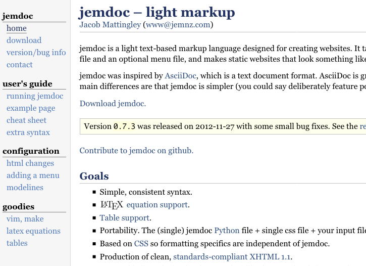
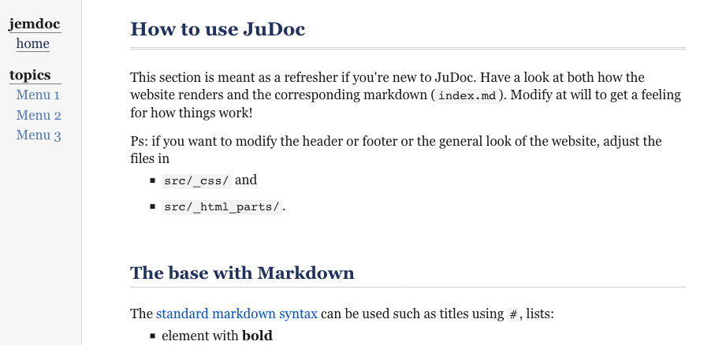

# Themes

```@raw html
The pre-defined themes/templates that are currently available can be viewed <a href="https://tlienart.github.io/JuDocTemplates.jl/" target="_blank" rel="noopener noreferrer">here</a> (opens in a new tab).
```

In this section, you will learn how to build a layout from one online.
It should also help clarify the structure of the files that define the layout.
If you end up doing this yourself and assuming you're happy with the result, a PR to [JuDocTemplates](https://github.com/tlienart/JuDocTemplates.jl) would be very welcome!

## Adapting a theme to JuDoc

As an example, I'll take [Jemdoc's site](http://jemdoc.jaboc.net/) both because it's a pretty simple layout and as a way to honour its legacy since JuDoc was inspired from it.

Jemdoc's layout looks like this:



### Getting started

In order to get a blueprint for the folder etc, let's first create a site according to the `basic` template:

```julia-repl
julia> newsite("jemdoc", template="basic")
```

You can serve the site in order to see the modifications directly in your browser which can be useful to fine tune the port of the layout.

We will need to provide the appropriate stylesheet in `src/_css` and adjust the layout part in `src/_html_parts`.

### Adapting the head and foot

The file `src/_html_parts/head.html` is the most important one you will have to adjust.

Let us first change the name of the main stylesheet `src/_css/basic.css` into `src/_css/jemdoc.css` which is more appropriate.
The reference to the stylesheet in `head.html` consequently has to be changed to mention `jemdoc.css` instead of `basic.css`:

```html
<link rel="stylesheet" href="/css/jemdoc.css">
```

The steps here subsequently quite simple:

1. look at the original html code
2. copy whatever comes before the content into `head.html`

Let's do this gradually.
The top of the original HTML can be ignored at this point so we can start modifying starting after `</head>`.

Jemdoc's body starts with a Google analytics script which I'll ignore as well.
We then have effectively one big table element.
Stripped from its content and simplified it looks like:

```html
<table id="tlayout">
  <tr valign="top">
    <td id="layout-menu">
      <div class="menu-category">jemdoc</div>
      <div class="menu-item"><a href="index.html" class="current">home</a></div>
    <div class="menu-category">topics</div>
      <div class="menu-item"><a href="/pub/menu1.html">Menu 1</a></div>
      <div class="menu-item"><a href="/pub/menu2.html">Menu 2</a></div>
      <div class="menu-item"><a href="/pub/menu3.html">Menu 3</a></div>
    </td>
    <td id="layout-content">
      <p> CONTENT HERE </p>
      <div id="footer">
        <div id="footer-text">
          Page generated by <a href="http://jemdoc.jaboc.net/">jemdoc</a>.
        </div>
      </div>
    </td>
  </tr>
</table>
```

Note that I've already filled in the `href=` in the links to sub-menus.

The "`CONTENT HERE`" part is where what JuDoc generates from Markdown will go.
Therefore, anything that is *after* that should go in `foot.html`; in our current case:

```html
      <div id="footer">
        <div id="footer-text">
          Page generated by <a href="http://jemdoc.jaboc.net/">jemdoc</a>.
        </div>
      </div>
    </td>
  </tr>
</table>
```

That's basically it (though we still have to modify the stylesheet of course).
The `head.html` should be adapted to:

```html
<!doctype html>
<html lang="en">
<head>
  <meta charset="UTF-8">
  <meta name="viewport" content="width=device-width, initial-scale=1">
  {{if hasmath}} {{insert head_katex.html }}     {{end}}
  {{if hascode}} {{insert head_highlight.html }}   {{end}}
  <link rel="stylesheet" href="/css/judoc.css">
  <link rel="stylesheet" href="/css/jemdoc.css">
  <link rel="icon" href="/assets/infra/favicon.png">
  {{isdef title}} <title>{{fill title}}</title>  {{end}}
</head>
<body>
  <table id="tlayout">
    <tr valign="top">
      <td id="layout-menu">
        <div class="menu-category">jemdoc</div>
        <div class="menu-item"><a href="index.html" class="current">home</a></div>
      <div class="menu-category">topics</div>
        <div class="menu-item"><a href="/pub/menu1.html">Menu 1</a></div>
        <div class="menu-item"><a href="/pub/menu2.html">Menu 2</a></div>
        <div class="menu-item"><a href="/pub/menu3.html">Menu 3</a></div>
      </td>
      <td id="layout-content">

<!-- Content appended here -->
```

and the `foot.html` should be adapted to:

```html
<!-- CONTENT ENDS HERE -->
        </td>
      </tr>
    </table>
    {{ if hasmath }}
        {{ insert foot_katex.html }}
    {{ end }}
    {{ if hascode }}
        {{ insert foot_highlight.html }}
    {{ end }}
  </body>
</html>
```

### Adapting the stylesheet

Of course by now the page looks horrendous:


the content is not centred in its box and overflows on the right, the menu looks ridiculous, time to do some CSS styling!

Let's start by removing everything from `src/_css/jemdoc.css`.
Most of what's in there was used for the styling of the top navbar which we don't have anymore (note that the styling of the content itself is in `judoc.css`, don't change that for now; note also that `jemdoc.css` is loaded *after* `judoc.css` so that you can overwrite the styles there).

Let's now just copy paste the content of the [two](http://jemdoc.jaboc.net/jemdoc.css) [original](http://jemdoc.jaboc.net/jacob.css) stylesheets into ours and hope for the best, we may have some fine-tuning to do after this.

Doing nothing else than copy pasting already starts to look quite civilised:


but a few small things should be fixed:

1. there's too little space at the top
1. the menu is a bit too narrow and there's a bit too much space between the menu and the content
1. there's not enough space after `<pre>` blocks

#### Fixing spacing

Firefox or Chrome/ium's excellent dev-tools are super helpful to fine tune stylesheets.
Here things are pretty straightforward though.

Firstly we need to add vertical padding above `<h1>` level title:

```css
h1 { padding-top: 2em; }
```

Then, let's widen the menu a little

```css
td#layout-menu {
  padding-left: 15px;
  padding-right: 25px;
}
```

and let's reduce the padding on the left of the `jd-content` element:

```css
.jd-content { padding-left: 5%; }
```

Thirdly, in the original stylesheet there is this element:

```css
pre {
  padding: 0;
  margin: 0;
}
```

which you can just remove to have a bit more space around code blocks.

There's probably still things that could be done to improve the layout overall (and make it more responsive!) but we'll leave it at that.



### Adjusting other files

Here we don't need to adjust anything else but you could want to adjust the pages in another context:

* `head_highlight`, `head_katex`, `foot_highlight` and `foot_katex` are probably best left as they are, they will be appended if need be to pages (see in `head` and `foot` the `{{if hasmath}}` and `{{if hascode}}` blocks)
* `page_foot` you may want to change, it defines what goes at the bottom of the `.jd-content` div.

By default `page_foot` looks like

```html
<div class="page-foot">
  <div class="copyright">
    &copy; {{ fill author }}. Last modified: {{ fill jd_mtime }}. Website built with <a href="https://github.com/tlienart/JuDoc.jl">JuDoc.jl</a>.
  </div>
</div>
```

It should be fairly straightforward to adapt that to your needs.

## Making a PR to the theme repo

Let's say you've built your own template and are pretty happy with the result and you'd like to share it for other users, great! thanks for being a good citizen.

### Create a new folder

Head to the [JuDocTemplates.jl](https://github.com/tlienart/JuDocTemplates.jl) repository and make a PR.
The key is to keep track of what you've modified and what was left as before so that the repo is not cluttered with copies of the same file.

In the example above the following files were changed:

* `head.html` and `foot.html`,
* `jemdoc.css` the stylesheet.

The JuDocTemplates repository automatically fills in the gap so you just have to provide the files that have changed.
Imitate the structure corresponding to [`basic`](https://github.com/tlienart/JuDocTemplates.jl/tree/master/src/templates/basic/src):

```
.
└── src
    ├── _css
    │   └── basic.css
    └── _html_parts
        └── head.html
```

So in the case of `jemdoc`, I will create a new folder `jemdoc` in `src/templates/` with

```
.
└── src
    ├── _css
    │   └── jemdoc.css
    └── _html_parts
        ├── foot.html
        └── head.html
```

### Add your template to the list

Next, you need to indicate the new template in `JuDocTemplates.jl` by simply adding it to the `LIST_OF_TEMPLATES` constant.

Then, you need to add a description for your template in `docs/make.jl` (please respect the alphabetical order):

```julia
"jemdoc" => """
            <span class="th-name">jemdoc</span>
            <p>Simple theme with a side navigation bar, no extra javascript and a simple stylesheet. (Adapted from the original Jemdoc theme.)</p>
            """,
```

Lastly you need to take a screenshot of what the template looks like of size 480x480, put it in `docs/thumb` and adjust `docs/index_head.html` following the example of the other templates:

```css
#jemdoc {
  background: url("thumb/jemdoc.png");
  background-size: contain;
}
```

### Check that things work

Finally, you need to check that everything works (which is the first thing I'll do when reviewing your PR).
For that: first run the file `docs/make.jl`; this will generate a website in `docs/build` then using for instance [`LiveServer.jl`](https://github.com/asprionj/LiveServer.jl), check the generated website and that the demo corresponding to your template works as expected.

And that's it! thanks a lot!
